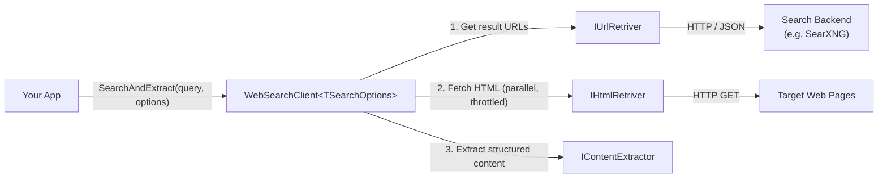

# DeepSigma.DataAccess.WebSearch.WebSearchClient

A .NET orchestrator that turns a search query into structured page content. Given a query, it retrieves result URLs from a search backend (e.g. [SearXNG](https://docs.searxng.org/)), fetches each page's HTML in parallel, and extracts structured content (title, byline, language, published date, main text).

This package is the glue layer. The actual URL retrieval, HTML fetching, and content extraction are provided by three sibling NuGet packages — swap any of them for a different implementation of the same interface without touching this code.

[](https://dotnet.microsoft.com)
[](LICENSE)

---

## Table of Contents

- [How It Fits Together](#how-it-fits-together)
- [Installation](#installation)
- [Quick Start](#quick-start)
- [API Reference](#api-reference)
- [Error Handling](#error-handling)
- [Running SearXNG Locally](#running-searxng-locally)
- [Known Issues](#known-issues)
- [License](#license)

---

## How It Fits Together

This package ships a single public class, `WebSearchClient<TSearchOptions>`, that orchestrates three external dependencies:

| Dependency | Package | Responsibility |
|---|---|---|
| `IUrlRetriver<TSearchOptions>` | `DeepSigma.DataAccess.WebSearch.UrlRetriever` | Sends the query to a search backend and returns result URLs |
| `IHtmlRetriver` | `DeepSigma.DataAccess.WebSearch.UrlRetriever` | Fetches raw HTML for a given URL |
| `IContentExtractor` | `DeepSigma.DataAccess.WebSearch.ContentExtraction` | Parses HTML and extracts structured content |

Interfaces and domain models (`ResponseUrlRetrival`, `ResponseHtmlContent`, `ResponseExtractedContent`) live in `DeepSigma.DataAccess.WebSearch.Abstraction`.



**Data flow:**

1. Caller invokes `SearchAndExtract(query, options, maxConcurrency, ct)` on `WebSearchClient`.
2. `IUrlRetriver` queries the search backend and returns a list of URLs.
3. Each URL is fetched via `IHtmlRetriver` in parallel, throttled by a `SemaphoreSlim` (default: 8 concurrent requests).
4. Each HTML document is parsed by `IContentExtractor` into a `ResponseExtractedContent`.
5. Results are aggregated and returned; per-URL failures produce a `ResponseExtractedContent` with `Error = true`.

---

## Installation

```shell
dotnet add package DeepSigma.DataAccess.WebSearch.WebSearchClient
```

This transitively pulls in `Abstraction`, `UrlRetriever`, and `ContentExtraction`.

---

## Quick Start

```csharp
using Microsoft.Extensions.DependencyInjection;
using Microsoft.Extensions.Logging;
using DeepSigma.DataAccess.WebSearch.WebSearchClient;
using DeepSigma.DataAccess.WebSearch.UrlRetriever;
using DeepSigma.DataAccess.WebSearch.UrlRetriever.Models;
using DeepSigma.DataAccess.WebSearch.Abstraction.Model;
using DeepSigma.DataAccess.WebSearch.ContentExtraction.Extensions;

var services = new ServiceCollection();

services.AddLogging(b => b.AddConsole());

// Register the SearXNG-backed URL retriever (from UrlRetriever package).
services.AddSearxngClient(new SearxngOptions
{
    BaseUri   = new Uri("http://localhost:8080"),
    Timeout   = TimeSpan.FromSeconds(10),
    UserAgent = "MyApp/1.0"
});

// Register the content extractor (from ContentExtraction package).
services.AddWebPageDataExtraction();

// Register the orchestrator.
services.AddSingleton<WebSearchClient<SearchRequestOptions>>();

await using var provider = services.BuildServiceProvider();
var client = provider.GetRequiredService<WebSearchClient<SearchRequestOptions>>();

var searchOptions = new SearchRequestOptions
{
    Engines   = ["google"],
    Language  = "en",
    TimeRange = "week"
};

List<ResponseExtractedContent>? results =
    await client.SearchAndExtract("climate change research", searchOptions);

foreach (var r in results ?? [])
{
    Console.WriteLine($"{r.Title} ({r.PublishedAt}) — {r.Byline}");
    Console.WriteLine(r.MainText);
}
```

See [Program.cs](DotNet.DeepSigma.DataAccess.WebSearch.WebSearchClientDemoApp/Program.cs) for the full runnable demo.

---

## API Reference

### `WebSearchClient<TSearchOptions>`

Generic orchestrator. `TSearchOptions` is the options type understood by the registered `IUrlRetriver<TSearchOptions>` — for the SearXNG retriever it is `SearchRequestOptions`.

**Constructor** (resolved via DI):

```csharp
WebSearchClient(
    IUrlRetriver<TSearchOptions> urlRetriver,
    IHtmlRetriver                 htmlRetriver,
    IContentExtractor             contentExtractor,
    ILogger<WebSearchClient<TSearchOptions>> logger)
```

**Method:**

```csharp
Task<List<ResponseExtractedContent>?> SearchAndExtract(
    string            query,
    TSearchOptions    searchOptions,
    int               maxConcurrency    = 8,
    CancellationToken cancellationToken = default)
```

| Parameter | Description |
|---|---|
| `query` | The search query string. |
| `searchOptions` | Backend-specific options (engines, language, time range, etc.). |
| `maxConcurrency` | Maximum number of URLs fetched and extracted concurrently. Defaults to 8. |
| `cancellationToken` | Cancels the whole pipeline. On cancellation, `OperationCanceledException` is rethrown. |

**Return value:**

- `List<ResponseExtractedContent>` — one entry per URL that was processed. URLs whose HTML fetch or extraction threw return an entry with `Error = true` and the exception message in `ErrorMessage`.
- `null` — the URL-retrieval step itself failed (e.g. the search backend was unreachable). Details are logged.

### `ResponseExtractedContent`

Fields populated on a successful extraction (from the `Abstraction` package):

| Field | Description |
|---|---|
| `Title` | Page title. |
| `Byline` | Author or byline, when available. |
| `Language` | Detected language of the page. |
| `PublishedAt` | Published or last-modified date, when available. |
| `MainText` | Primary textual content of the page. |
| `Error` | `true` when extraction failed for this URL. |
| `ErrorMessage` | List of error messages when `Error` is `true`. |

---

## Error Handling

`WebSearchClient` is intentionally tolerant — a single bad URL should not abort the whole batch.

| Failure | Behavior |
|---|---|
| `IUrlRetriver` throws (backend unreachable, bad response, etc.) | The exception is logged and `SearchAndExtract` returns `null`. |
| `IHtmlRetriver` or `IContentExtractor` throws for a single URL | The exception is logged and a `ResponseExtractedContent` with `Error = true` and the message in `ErrorMessage` is included in the result list. |
| `OperationCanceledException` at any stage | Logged as a warning and rethrown to the caller. |

Exception types and HTTP-level error classification are the responsibility of the underlying `UrlRetriever` and `ContentExtraction` packages — see their READMEs.

---

## Running SearXNG Locally

The default SearXNG Docker image ships with JSON format **disabled**, which causes HTTP 403 on API requests. The `docker-compose.yml` and `searxng-settings.yml` in this repo start a correctly configured instance:

```shell
docker compose up
```

This exposes SearXNG at `http://localhost:8080` with `json` added to `search.formats`, matching the `BaseUri` in the quick-start example.

---

## Known Issues

- The `IUrlRetriver` interface name in the upstream `Abstraction` package is misspelled (missing an `e`). Fixing it is a breaking change and must happen in that package; this repo uses the spelling as-published.
- The `DeepSigma.DataAccess.WebSearch.Test` project currently contains no tests.

---

## License

MIT — see [LICENSE](LICENSE).

---

*Built by [DeepSigma LLC](https://github.com/DeepSigma-LLC)*
